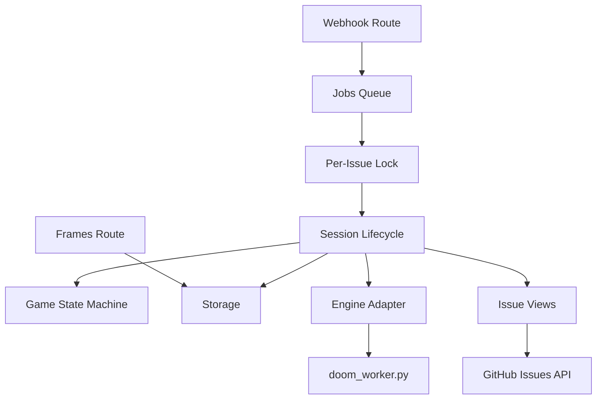

# V1 Components

## Component List

- `routes/*`: HTTP entry points (`webhook`, `frames`, `health`, `debug`)
- `sessions/lifecycle.js`: session start/step/close/reopen orchestration
- `game.js`: command normalization, repeat handling, state transition helpers
- `jobs/*`: queue, per-issue lock, job status store
- `github/*`: Octokit client, issue update/comment helpers, signature/repo checks
- `views/*` + `issueBody.js`: markdown section generation and merge
- `engine.js`: Python process execution (`fetch_doom_assets.py`, `doom_worker.py`)
- `storage.js`: file paths + JSON/frame persistence
- `renderer/frames.js`: frame URL generation with tick cache-busting

## Component Relationship

## State and Artifacts

- Session state: `data/sessions/<issue>.json`
- Rendered frame: `data/frames/<issue>.png`
- Job status: in-memory map (`unknown/queued/running/completed/failed`)
