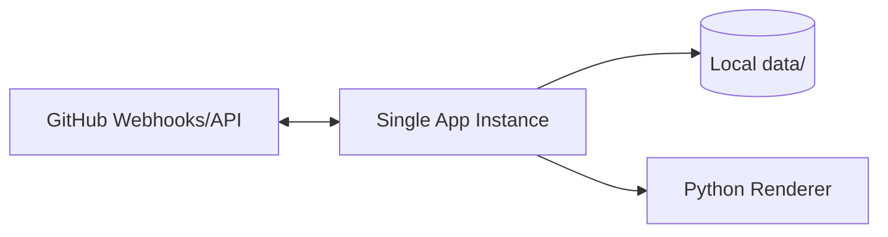

# V1 Deployment Design

## Docker Runtime

`issues-game-bot/Dockerfile` builds a unified Node+Python image:

- Node 20 base
- Python + venv + pip deps (`vizdoom`, `Pillow`)
- OS libs for Doom runtime
- fetches Doom assets
- clones/builds doomgeneric with custom issuebot runner

## Environment Variables

Required:

- `GITHUB_TOKEN`
- `GITHUB_OWNER`
- `GITHUB_REPO`
- `GITHUB_WEBHOOK_SECRET`
- `PUBLIC_BASE_URL` (recommended)

Optional:

- `ISSUE_COOLDOWN_MS`
- `DOOM_BOOT_DELAY_MS`
- `DOOM_INACTIVITY_MS`
- `DOOM_ENGINE`, `DOOM_MODE`
- `DOOM_TICS_PER_COMMENT`
- `DOOM_FRAME_SCALE`
- `DOOM_PNG_COMPRESS_LEVEL`
- `DOOM_PNG_OPTIMIZE`
- `PYTHON_BIN`

## Runtime Topology (V1)

## Operational Endpoints

- `/health` for basic readiness signal
- `/debug/issues/:id` for in-process job status visibility
