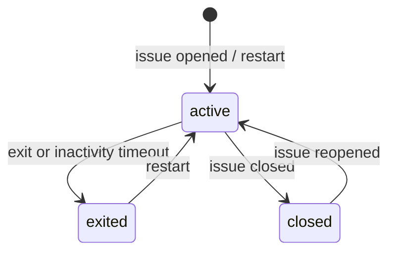

# V1 Session Lifecycle

## Session Model

Core fields in session JSON:

- `issueNumber`, `seed`
- `tick`, `status`, `issueState`
- `lastActivityAt`, `inactivityNotifiedAt`, `pauseNoticeNotifiedAt`
- `history[]` (normalized command replay source)
- `log[]` (recent user-facing events)

## Command Model

Supported base commands:

- movement: `w`, `a`, `s`, `d` (plus arrow aliases)
- action/menu: `fire` (`shoot` alias), `enter`, `esc`
- control: `help`, `restart`, `exit`, `quit`

Repeat count is parsed from second token (e.g. `right 6`), max 12.

## Lifecycle State Flow

## Behavior Guards

- If session inactive beyond `DOOM_INACTIVITY_MS`, next non-restart command exits game and posts one-time notice.
- If status is `closed/exited/inactive` and command is not `restart`, post one-time pause notice.
- If issue is closed and command not `restart`, block action and notify once.
