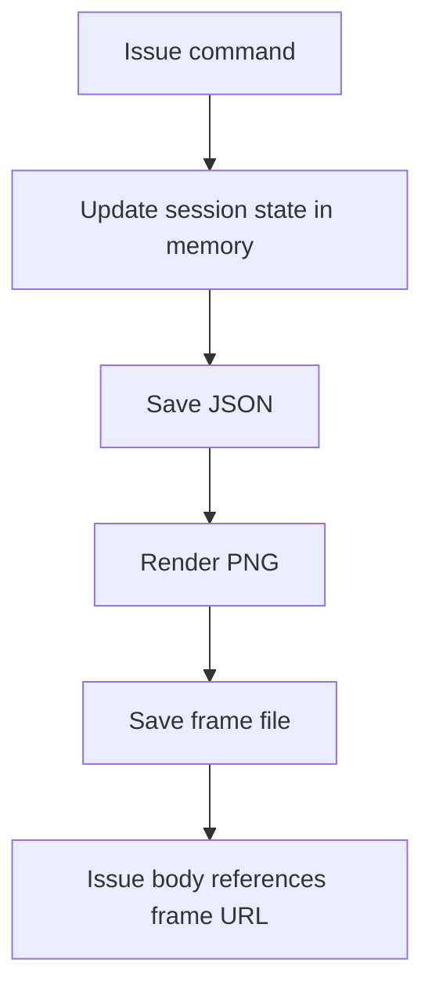

# V1 Storage Design

## Local Filesystem Layout

```text
data/
  sessions/
    <issueNumber>.json
  frames/
    <issueNumber>.png
```

## Access Layer

- source: `src/storage.js`
- responsibilities:
  - ensure directories exist
  - load/save session JSON
  - resolve frame/session paths
  - session existence check

## Data Lifecycle



## V1 Limitation

Storage is local to process/container and not designed for multi-instance durable production.
