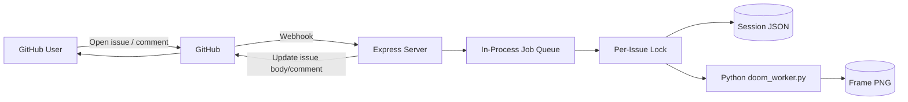

# V1 System Design

## Scope
`issues-game-bot` is a turn-based Doom controller over GitHub Issues:

- one issue = one session
- one comment = one command step
- issue body shows the latest frame image and state/log summary

## High-Level Flow

## Runtime Boundaries

- Node.js owns webhook validation, orchestration, issue updates, and session lifecycle.
- Python owns rendering (doomgeneric primary, vizdoom fallback).
- File system stores session JSON and PNG frames.
- GitHub is both input transport (webhooks) and output UI surface (issue body markdown + comments).

## Key Properties

- Async webhook processing with immediate `202` response.
- Per-issue serialization via lock chaining.
- Process-local queue/throttle/state (single-instance behavior).
- Deterministic re-render by replaying command history each step.
