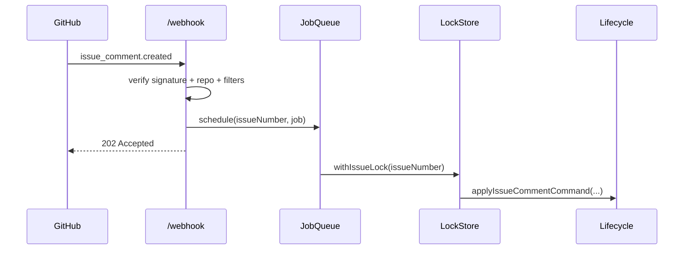

# V1 Webhook Design

## Endpoint

- `POST /webhook`
- source: `src/routes/webhook.js`

## Validation Pipeline

1. Verify `x-hub-signature-256` with `GITHUB_WEBHOOK_SECRET`.
2. Ensure GitHub token is configured.
3. Ensure payload repository matches `GITHUB_OWNER` and `GITHUB_REPO`.
4. Route by `x-github-event` + `payload.action`.

## Event Handling

- `issues.opened`: write loading view, schedule `startIssueSession` with boot delay.
- `issues.closed`: schedule `closeIssueSession`.
- `issues.reopened`: schedule `reopenIssueSession`.
- `issue_comment.created`: skip empty/bot comments, apply cooldown, schedule `applyIssueCommentCommand`.

## Sequence (Comment)

## Operational Notes

- heavy work is async, not in request path
- cooldown is per issue (`ISSUE_COOLDOWN_MS`)
- lock is per issue to avoid out-of-order updates
