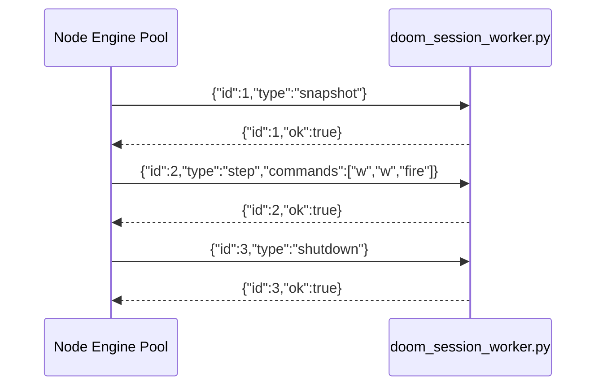

# V2 Runtime Components

## Node Side

- `src/engine.js`
  - new persistent engine pool
  - manages one Python worker process per issue
  - API: `startSession`, `applyCommands`, `restartSession`, `stopSession`, `invalidate`

- `src/sessions/artifacts.js`
  - saves session JSON
  - uses persistent engine for start/step/restart
  - fallback to legacy replay renderer if persistent path errors

- `src/sessions/lifecycle.js`
  - threads engine through start/apply/close
  - stops worker on close/inactivity/exit states

## Python Side

- `scripts/doom_session_worker.py`
  - long-lived stdin/stdout JSON protocol
  - keeps a live ViZDoom game instance
  - commands:
    - `snapshot`
    - `step` with command list
    - `shutdown`

## Protocol

