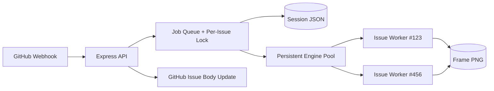

# V2 System Design

V2 keeps the same GitHub-driven control plane, but changes rendering from "full replay each command" to "continuously running per-issue Doom process".

## Core Change

- V1: start renderer every command, replay whole history, capture frame.
- V2: keep a live Python Doom session worker per issue and apply only new commands.

## Architecture

## Notes

- Per-issue worker is long-lived in process.
- Worker commands are incremental (`step`) and frame snapshot is updated after each step.
- If worker fails, server falls back to V1 replay render path.
