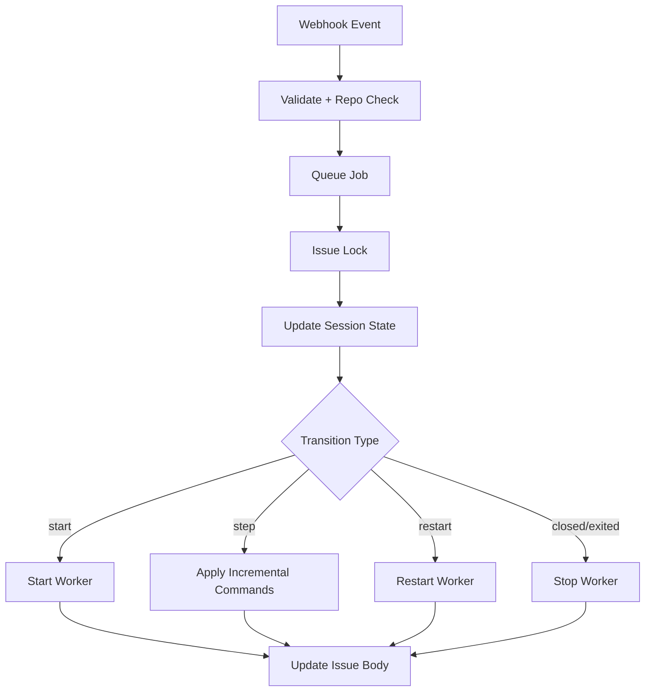

# V2 Webhook Flow

## Open Issue

1. Write loading view.
2. Queue job.
3. Start session state.
4. Start persistent worker and take initial snapshot.
5. Update issue body with first frame.

## Comment Command

1. Validate webhook and filters.
2. Queue + per-issue lock.
3. Apply state transition in `game.js`.
4. Send only newly applied commands to persistent worker.
5. Worker updates frame.
6. Update issue body markdown.

## Close or Inactive Exit

- Mark session state as closed/exited.
- Stop persistent worker for that issue.

## Flow Diagram

