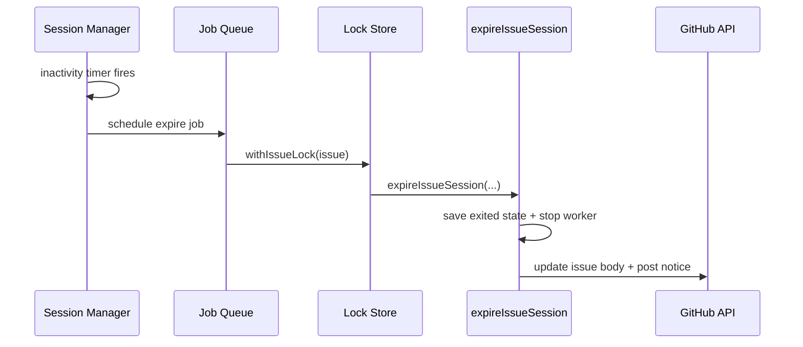

# Session Manager

## Responsibility

`src/sessions/manager.js` now owns:

- active session records by issue number
- per-session inactivity timers
- per-session runtime metadata (`lastTouchedAt`, `expiresAt`, `expiring`)
- worker start/restart/apply/stop delegation to the persistent engine
- async expiry callback into lifecycle code

## Session Record

Each in-memory record tracks:

- `issueNumber`
- `seed`
- `framePath`
- `status`
- `lastTouchedAt`
- `expiresAt`
- `expiring`

## Expiry Flow

## Debug Endpoints

- `GET /debug/issues/:issueNumber`
- `GET /debug/sessions`
