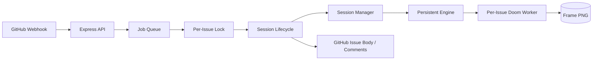

# V2.5 System Design

V2.5 introduces a dedicated session manager inside the app runtime.

## Core Idea

- V2: persistent worker support existed, but lifecycle and inactivity handling were spread across routes, lifecycle code, and engine helpers.
- V2.5: a `session manager` owns active issue sessions, exact inactivity timers, worker status, and expiry callbacks.

## Runtime Diagram

## What Changed

- inactivity is now timer-driven, not only lazily checked on next comment
- debug surface now includes session-manager state
- session ownership is explicit instead of implicit in engine code
- runtime composition moved into `src/runtime.js`, which now supports local E2E server smoke tests with injected dependencies
- active sessions prefer in-memory hot state before repository reads
- job debug state now includes queue/run timing for speed validation
