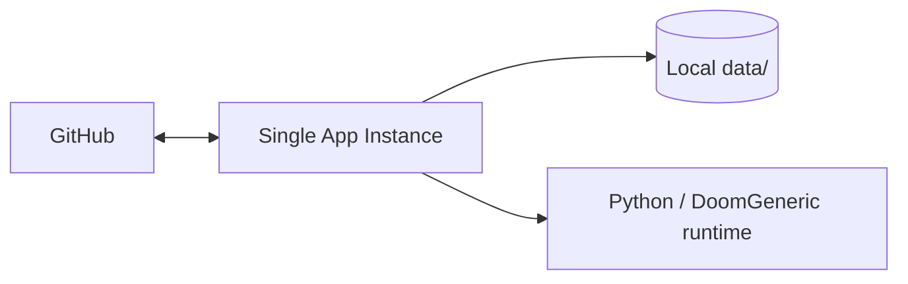
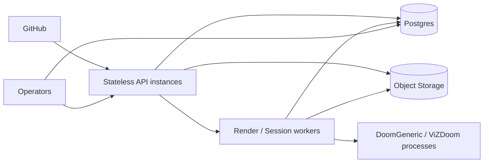

# V3 Deployment

## Current Runtime Topology

## Recommended Production Topology

## Operational Surface in V3

- `GET /health`
- `GET /debug/issues/:issueNumber`
- `GET /debug/issues/:issueNumber/events`
- `GET /debug/sessions`
- `GET /debug/runtime`

## Remaining Gaps After V3

- queue is still in-process
- timers are still in-process
- object storage is not yet implemented
- Postgres adapters are scaffolded, not the default runtime path
