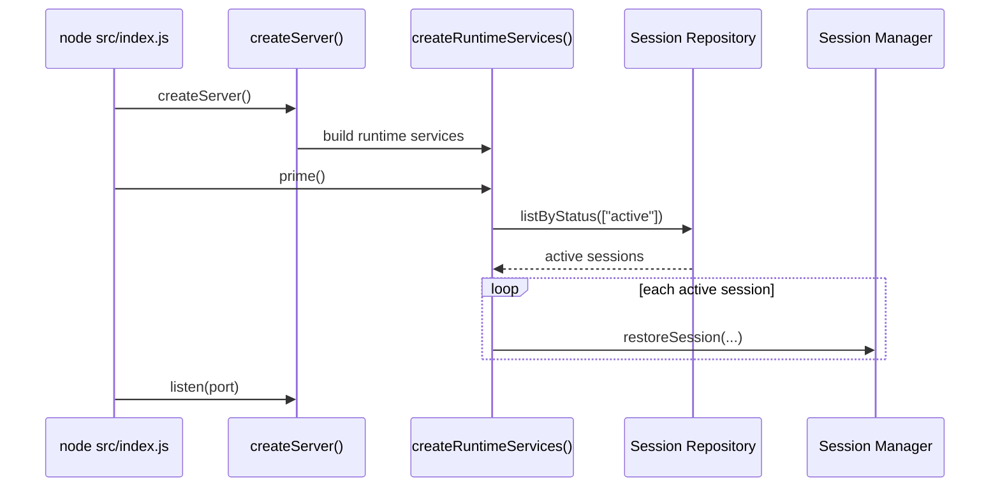
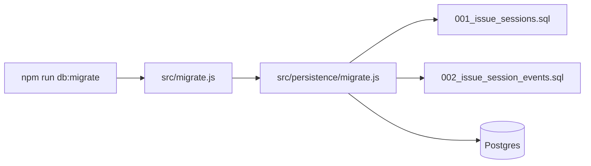

# V3 Operations

## Startup Bootstrap



## Runtime Health Surface

```mermaid
flowchart TD
  HEALTH[/health] --> H1[githubConfigured]
  HEALTH --> H2[runtime.repository modes]
  HEALTH --> H3[Postgres health check when enabled]
  DEBUG1[/debug/runtime] --> D1[recovery metadata]
  DEBUG1 --> D2[repositoryInfo]
  DEBUG2[/debug/issues/:id] --> D3[job timing]
  DEBUG2 --> D4[live session state]
  DEBUG2 --> D5[event count]
  DEBUG3[/debug/issues/:id/events] --> D6[append-only event log]
```

## Migration Flow



## Production Use

1. Set `DATABASE_URL`.
2. Run `npm run db:migrate`.
3. Deploy service.
4. Confirm `/health`.
5. Confirm `/debug/runtime` shows expected repository mode.
