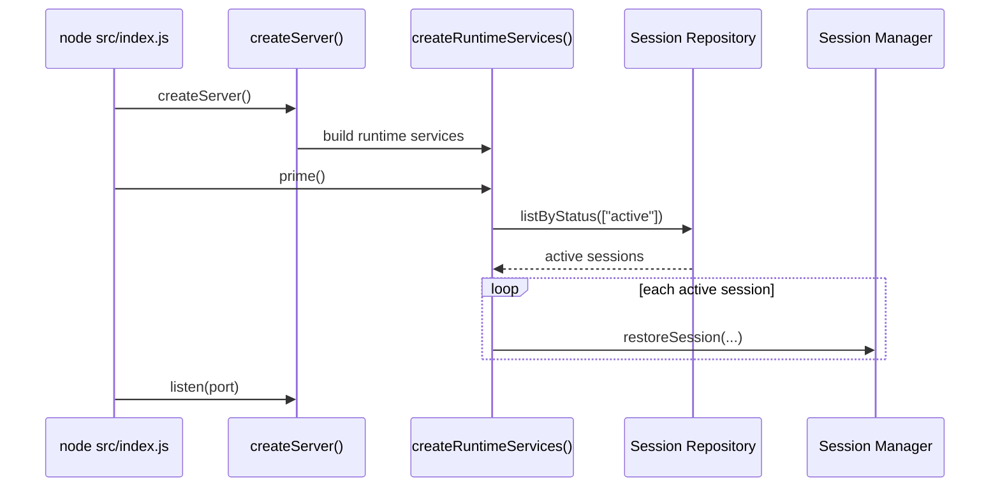
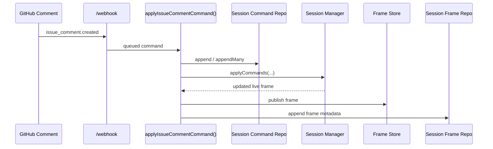
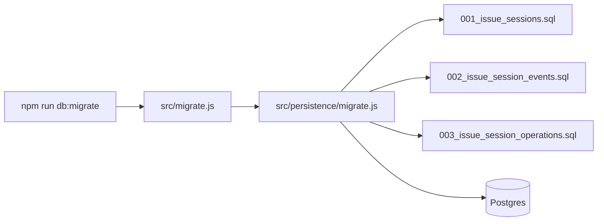

# V3 Operations

## Startup Bootstrap

## Runtime Health Surface

```mermaid
flowchart TD
  HEALTH["/health"] --> H1["githubConfigured"]
  HEALTH --> H2["runtime.repository modes"]
  HEALTH --> H3["Postgres health checks for session and operational repos"]
  HEALTH --> H4["S3 bucket health check when enabled"]
  DEBUG1["/debug/runtime"] --> D1["recovery metadata"]
  DEBUG1 --> D2["repositoryInfo + workerId"]
  DEBUG2["/debug/issues/:id"] --> D3["job timing"]
  DEBUG2 --> D4["live session state"]
  DEBUG2 --> D5["event count + command count + frame count + lease"]
  DEBUG3["/debug/issues/:id/events"] --> D6["append-only event log"]
  DEBUG4["/debug/issues/:id/commands"] --> D7["command journal"]
  DEBUG5["/debug/issues/:id/frames"] --> D8["published frame metadata"]
  DEBUG6["/debug/leases"] --> D9["active lease view"]
```

## Command Execution Persistence

## Migration Flow

## Production Use

1. Set `DATABASE_URL`.
2. Set `FRAME_S3_BUCKET`, `FRAME_S3_REGION`, `FRAME_S3_PUBLIC_BASE_URL`, and AWS credentials.
3. Run `npm run db:migrate`.
4. Deploy service.
5. Confirm `/health`.
6. Confirm `/debug/runtime` shows expected repository mode.
7. Confirm `/debug/leases` and `/debug/issues/:id/commands` are being populated after live traffic.
