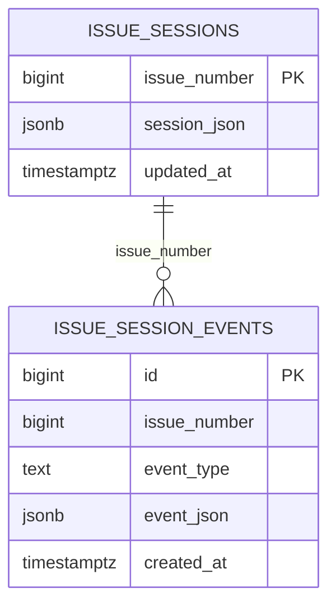

# V3 Persistence Design

## Data Stores

```mermaid
flowchart LR
  LC[Session Lifecycle] --> SR[(Session Repository)]
  LC --> ER[(Session Event Repository)]
  SM[Session Manager] --> SR
  DBG[/debug/issues/:id/events] --> ER
```

## Logical Model



## Repository Behavior

- `sessionRepository`
  - `load`
  - `loadOptional`
  - `save`
  - `exists`
  - `listByStatus`

- `sessionEventRepository`
  - `append`
  - `list`
  - `count`

## Storage Modes

- `file`
  - session snapshot in `data/sessions/<issue>.json`
  - event journal in `data/events/<issue>.json`
- `postgres`
  - session row in `issue_sessions`
  - append-only rows in `issue_session_events`
