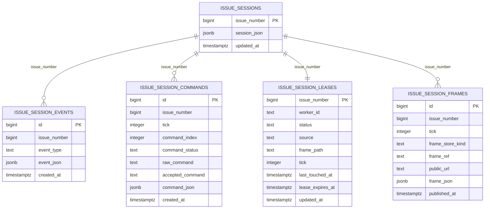

# V3 Persistence Design

## Data Stores

```mermaid
flowchart LR
  LC[Session Lifecycle] --> SR[(Session Repository)]
  LC --> ER[(Session Event Repository)]
  LC --> CR[(Session Command Repository)]
  LC --> FR[(Session Frame Repository)]
  LC --> FS[(Frame Store)]
  SM[Session Manager] --> SR
  SM --> LR[(Session Lease Repository)]
  DBG[/debug/issues/:id/events] --> ER
  DBG --> CR
  DBG --> FR
  DBG --> LR
```

## Logical Model



## Repository Behavior

- `sessionRepository`
  - `load`
  - `loadOptional`
  - `save`
  - `exists`
  - `listByStatus`

- `sessionEventRepository`
  - `append`
  - `list`
  - `count`
- `sessionCommandRepository`
  - `append`
  - `appendMany`
  - `list`
  - `count`
- `sessionLeaseRepository`
  - `get`
  - `upsert`
  - `remove`
  - `list`
- `sessionFrameRepository`
  - `append`
  - `latest`
  - `list`
  - `count`

## Storage Modes

- `file`
  - session snapshot in `data/sessions/<issue>.json`
  - event journal in `data/events/<issue>.json`
  - command journal in `data/commands/<issue>.json`
  - live lease mirror in `data/leases/<issue>.json`
  - frame metadata in `data/frame-meta/<issue>.json`
- `postgres`
  - session row in `issue_sessions`
  - append-only rows in `issue_session_events`
  - append-only rows in `issue_session_commands`
  - upserted lease row in `issue_session_leases`
  - per-tick frame rows in `issue_session_frames`

## Frame Store Modes

- `local`
  - rendered PNG remains in `data/frames/<issue>.png`
  - issue body points to `/frames/<issue>.png?t=<tick>`
- `s3`
  - rendered PNG is uploaded to object storage after each publish
  - issue body points directly to the public object URL with tick cache-busting

## Why This Split

- `session_json` stays fast for current-state reads.
- commands, leases, and frame publishes stop bloating the snapshot row.
- operational queries move to typed columns instead of deep JSONB filters.
