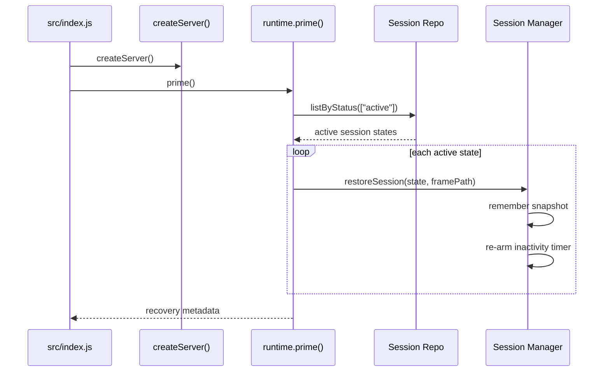
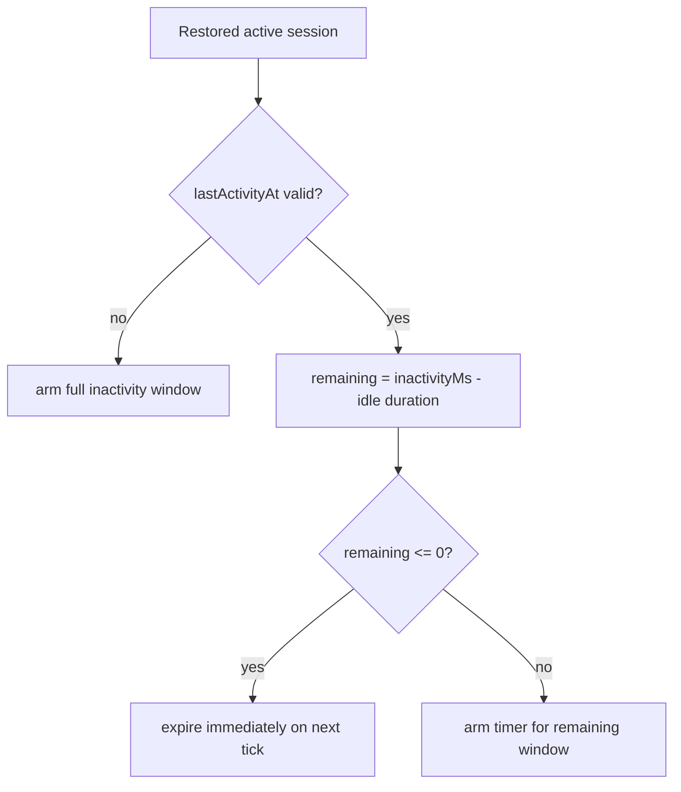

# V3 Recovery

## Boot Recovery Flow

```mermaid
sequenceDiagram
  participant IDX as src/index.js
  participant APP as createServer()
  participant RT as runtime.prime()
  participant SR as Session Repo
  participant SM as Session Manager

  IDX->>APP: createServer()
  IDX->>RT: prime()
  RT->>SR: listByStatus(["active"])
  SR-->>RT: active session states
  loop each active state
    RT->>SM: restoreSession(state, framePath)
    SM->>SM: remember snapshot
    SM->>SM: re-arm inactivity timer
  end
  RT-->>IDX: recovery metadata
```

## Timer Rehydration Logic

```mermaid
flowchart TD
  A[Restored active session] --> B{lastActivityAt valid?}
  B -->|no| C[arm full inactivity window]
  B -->|yes| D[remaining = inactivityMs - idle duration]
  D --> E{remaining <= 0?}
  E -->|yes| F[expire immediately on next tick]
  E -->|no| G[arm timer for remaining window]
```

## Recovery Metadata

`/debug/runtime` reports:

- `primed`
- `primeAt`
- `restoredCount`
- `restoredIssueNumbers`
