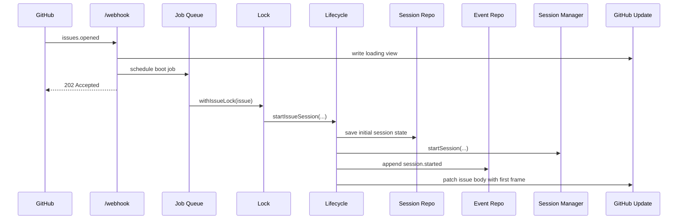
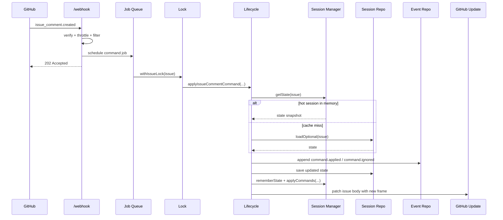
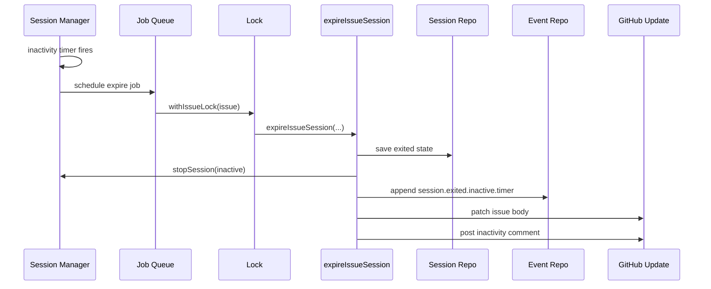

# V3 Sequences

## Issue Opened

```mermaid
sequenceDiagram
  participant GH as GitHub
  participant API as /webhook
  participant Q as Job Queue
  participant L as Lock
  participant LC as Lifecycle
  participant SR as Session Repo
  participant ER as Event Repo
  participant SM as Session Manager
  participant GHU as GitHub Update

  GH->>API: issues.opened
  API->>GHU: write loading view
  API->>Q: schedule boot job
  API-->>GH: 202 Accepted
  Q->>L: withIssueLock(issue)
  L->>LC: startIssueSession(...)
  LC->>SR: save initial session state
  LC->>SM: startSession(...)
  LC->>ER: append session.started
  LC->>GHU: patch issue body with first frame
```

## Comment Command

```mermaid
sequenceDiagram
  participant GH as GitHub
  participant API as /webhook
  participant Q as Job Queue
  participant L as Lock
  participant LC as Lifecycle
  participant SM as Session Manager
  participant SR as Session Repo
  participant ER as Event Repo
  participant GHU as GitHub Update

  GH->>API: issue_comment.created
  API->>API: verify + throttle + filter
  API->>Q: schedule command job
  API-->>GH: 202 Accepted
  Q->>L: withIssueLock(issue)
  L->>LC: applyIssueCommentCommand(...)
  LC->>SM: getState(issue)
  alt hot session in memory
    SM-->>LC: state snapshot
  else cache miss
    LC->>SR: loadOptional(issue)
    SR-->>LC: state
  end
  LC->>ER: append command.applied / command.ignored
  LC->>SR: save updated state
  LC->>SM: rememberState + applyCommands(...)
  LC->>GHU: patch issue body with new frame
```

## Inactivity Expiry

```mermaid
sequenceDiagram
  participant SM as Session Manager
  participant Q as Job Queue
  participant L as Lock
  participant LC as expireIssueSession
  participant SR as Session Repo
  participant ER as Event Repo
  participant GHU as GitHub Update

  SM->>SM: inactivity timer fires
  SM->>Q: schedule expire job
  Q->>L: withIssueLock(issue)
  L->>LC: expireIssueSession(...)
  LC->>SR: save exited state
  LC->>SM: stopSession(inactive)
  LC->>ER: append session.exited.inactive.timer
  LC->>GHU: patch issue body
  LC->>GHU: post inactivity comment
```
