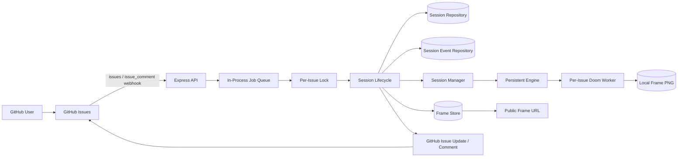
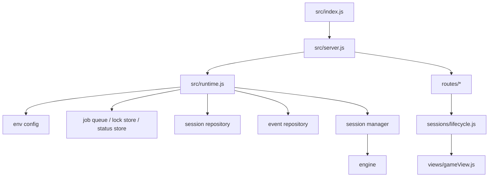

# V3 System Design

V3 adds two production-leaning capabilities on top of `v2.5`:

- append-only session event journaling
- runtime recovery of active sessions on boot

## End-to-End System

## Runtime Components

## V3 Outcomes

- every material session transition can now be replayed from the event journal
- boot-time recovery restores active sessions into the manager and re-arms inactivity timers
- frame publication is abstracted behind a local-or-S3 frame store
- debug surfaces can inspect queue timing, live session state, and event history together
