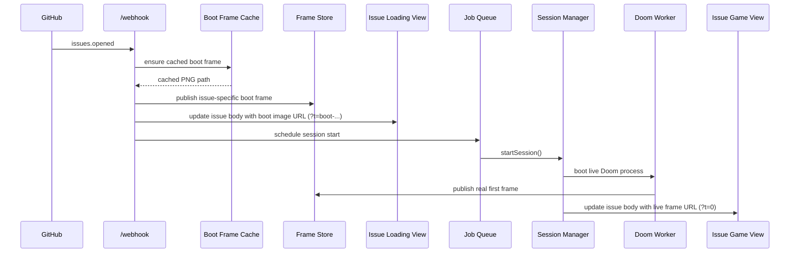
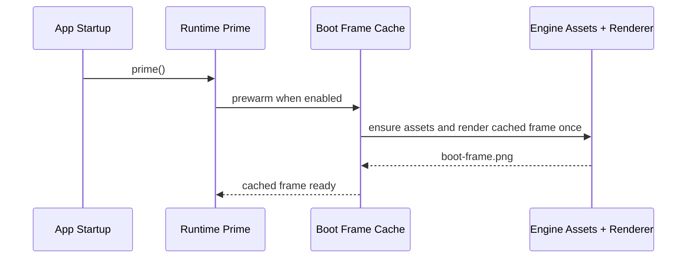

# V3.5 Startup Latency

## Issue Open Sequence

## Startup Prewarm

## Operational Notes

- `DOOM_BOOT_FRAME_CACHE=true`
  - enables the feature
- `DOOM_BOOT_FRAME_PREWARM=true`
  - avoids first-traffic boot-frame generation cost
- the cached frame improves perceived speed
- the real frame still depends on worker boot, render, publish, and GitHub update latency
