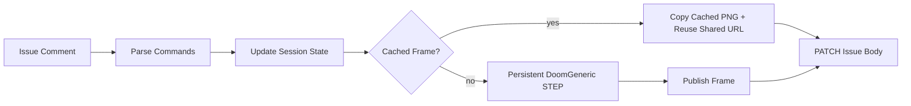

# V4 Release Notes

V4 is the latency and DoomGeneric persistence release.

- [release.md](./release.md)
- [architecture.md](./architecture.md)
- [sequences.md](./sequences.md)
- [persistent-doomgeneric.md](./persistent-doomgeneric.md)
- [latency-and-caching.md](./latency-and-caching.md)
- [operations.md](./operations.md)

## What Changed

- Cached startup/menu frames make the first common menu states effectively instant.
- Shared cached menu images use deterministic S3 object keys instead of Redis indirection.
- The gameplay hot path was reduced to command parsing, state update, render/cache hit, frame publish, and GitHub issue PATCH.
- Multiline and compact commands now batch into one final frame per comment.
- DoomGeneric persistence was rebuilt around a real ticking session worker instead of repeated replay from tick 0.
- Background persistent sync now coalesces to the newest target history instead of draining stale intermediate cached targets.
- Timing logs expose render, publish, PATCH, and total job time.

## Release Shape

V4 keeps GitHub Issues as both controller and display surface, but makes the backend loop much thinner:

