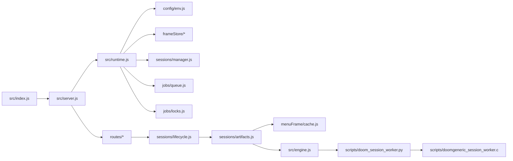
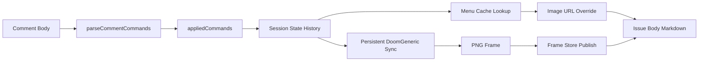
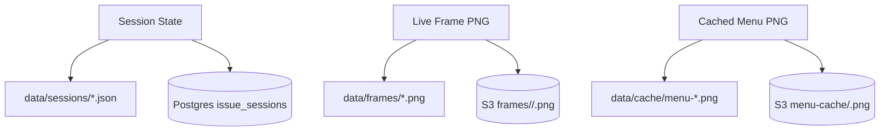

# V4 Architecture

## System Overview

```mermaid
flowchart TD
  U[GitHub User] --> GH[GitHub Issue Comment]
  GH --> WH[/webhook]
  WH --> Q[In-Process Job Queue]
  Q --> L[Per-Issue Lock]
  L --> LC[Session Lifecycle]

  LC --> G[Command Parser + Game State]
  G --> MC{Boot/Menu Cache Hit?}

  MC -->|yes| CPNG[Cached PNG]
  CPNG --> S3C[Shared S3 Menu Object]
  CPNG --> BG[Background Persistent Sync]

  MC -->|no| SM[Session Manager]
  SM --> DG[Persistent DoomGeneric Worker]
  DG --> PNG[Local Frame PNG]

  PNG --> S3[Frame Store: Local or S3]
  S3 --> GV[Issue Markdown View]
  S3C --> GV
  GV --> PATCH[GitHub Issue PATCH]
  PATCH --> GH

  BG --> SM
```

## Runtime Components



## Responsibilities

- `routes/webhook.js`
  - verifies GitHub webhook traffic
  - filters unsupported events
  - schedules work and returns quickly
- `jobs/queue.js`
  - keeps webhook work asynchronous
  - lets GitHub receive `202` before rendering finishes
- `jobs/locks.js`
  - serializes work per issue
  - prevents two comments from mutating one session at the same time
- `sessions/lifecycle.js`
  - loads current state
  - applies comment commands
  - updates the GitHub issue body after artifacts are ready
- `sessions/artifacts.js`
  - chooses cached frame, persistent render, or replay fallback
  - publishes frames through the frame store
- `sessions/manager.js`
  - owns in-memory issue session records
  - tracks live DoomGeneric history sync
  - coalesces background sync targets
- `engine.js`
  - spawns and manages persistent Python workers
  - enforces startup/request timeouts
  - runs replay renderer when needed
- `doom_session_worker.py`
  - bridges Node JSON requests to DoomGeneric or VizDoom
  - converts PPM captures to PNG
- `doomgeneric_session_worker.c`
  - owns the native DoomGeneric runtime
  - polls commands, ticks Doom, injects input, and captures frames

## Data Flow



## Storage



