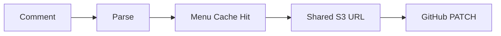
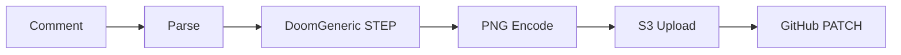
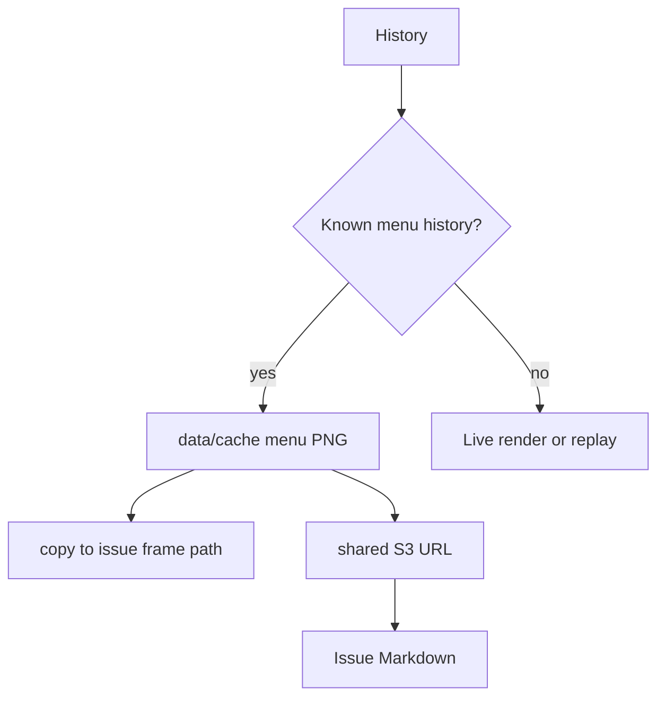
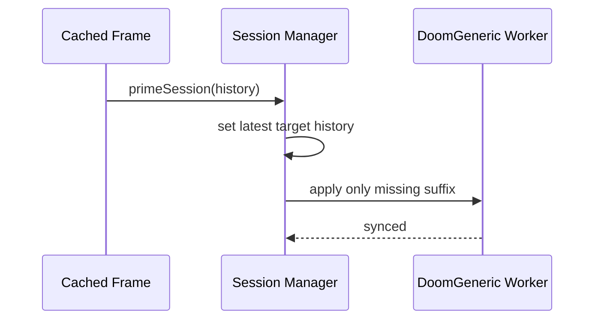

# V4 Latency And Caching

## Latency Budget

The fastest path is a cached menu frame:



The uncached live path has more work:



## What The Logs Mean

```text
issue=55 render_start mode=step command_count=5
issue=55 render_done ms=1600 cache_hit=false mode=step
issue=55 publish_done ms=872 cache_hit=false
issue=55 issue_patch_done ms=715 tick=40
issue=55 total_job_ms ms=3195 tick=40
```

- `render_done`: cache lookup or Doom render work
- `publish_done`: local/S3 frame publish
- `issue_patch_done`: GitHub issue-body PATCH
- `total_job_ms`: full queued job time after webhook acceptance

## Cached Menu Frames

V4 uses a local pre-rendered menu cache for common early histories:



The shared S3 keys are deterministic:

```text
<prefix>/menu-cache/enter.png
<prefix>/menu-cache/enter-enter.png
<prefix>/menu-cache/enter-enter-s.png
```

There is no Redis dependency in V4. The app can compute the shared URL directly.

## Background Sync

Cached frames are visual shortcuts. The live DoomGeneric worker still needs to catch up to the same history in the background:



V4 coalesces targets so quick cached inputs update the latest desired state instead of forcing old targets to finish first.

## Remaining Bottlenecks

- GitHub PATCH commonly takes hundreds of milliseconds.
- S3 upload commonly takes hundreds of milliseconds for live frames.
- GitHub image refresh happens after the app is already done.
- If persistent DoomGeneric is unavailable, replay fallback cost grows with session history.

## Useful Env Knobs

- `DOOM_PERSISTENT_SYNC_WAIT_MS=4000`
- `DOOM_BACKGROUND_SESSION_WORKER_STARTUP_TIMEOUT_MS=30000`
- `DOOM_SESSION_WORKER_STARTUP_TIMEOUT_MS=4000`
- `DOOM_SESSION_WORKER_TIMEOUT_MS=20000`
- `DOOM_FRAME_SCALE=0.8`
- `DOOM_PNG_COMPRESS_LEVEL=3`
- `DOOM_PNG_OPTIMIZE=false`
