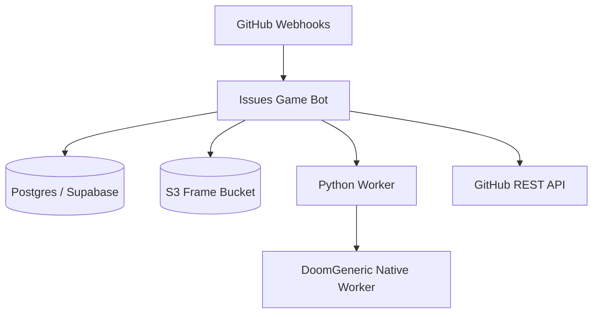

# V4 Operations

## Deployment Topology



## Recommended Production Env

```text
GITHUB_TOKEN=...
GITHUB_OWNER=...
GITHUB_REPO=...
GITHUB_WEBHOOK_SECRET=...
PUBLIC_BASE_URL=https://...

DATABASE_URL=postgres://...

FRAME_STORE=s3
S3_BUCKET_NAME=...
S3_FOLDER_NAME=frames
AWS_REGION=...
AWS_ACCESS_KEY_ID=...
AWS_SECRET_ACCESS_KEY=...

DOOM_ENGINE=doomgeneric
DOOM_PERSISTENT_ENGINE=auto
DOOM_MENU_FRAME_CACHE=true
DOOM_MENU_FRAME_PREWARM=true
DOOM_BOOT_FRAME_CACHE=true
DOOM_BOOT_FRAME_PREWARM=true
```

## Commands

- `w`, `a`, `s`, `d`: movement and turning
- `fire`: attack
- `enter` / `space`: Use/select/open doors
- `esc`: back/menu
- `restart`: restart session
- `exit`: stop session

## Runtime Checks

```mermaid
flowchart LR
  HEALTH[/health] --> H1[GitHub configured]
  HEALTH --> H2[repository modes]
  HEALTH --> H3[S3 health]
  DEBUG[/debug/runtime] --> D1[recovery metadata]
  DEBUG --> D2[cache settings]
  ISSUE[/debug/issues/:id] --> I1[job status]
  ISSUE --> I2[live session state]
```

## Expected Healthy Logs

Cached early state:

```text
issue=55 render_done ms=0 cache_hit=true
issue=55 publish_done ms=0 cache_hit=true
issue=55 issue_patch_done ms=650 tick=3
```

Live persistent state:

```text
issue=55 render_start mode=step command_count=5
issue=55 render_done ms=1600 cache_hit=false mode=step
issue=55 publish_done ms=872 cache_hit=false
issue=55 total_job_ms ms=3195 tick=40
```

Background sync:

```text
issue=55 persistent_sync_start synced_len=0 target_len=3
issue=55 persistent_sync_done ms=... synced_len=3
```

## Failure Signals

```text
persistent_engine_not_ready synced_len=0 expected_len=3
```

The visible path fell back to replay because the hidden worker was not caught up.

```text
session_worker_ready_timeout issue=... after ...
```

The Python worker did not print `READY` inside the configured timeout.

```text
doomgeneric_session_stdout=...
```

DoomGeneric printed non-protocol startup text. This is now diagnostic output, not automatically an error.

## Release Checklist

1. Build Docker image so `doomgeneric_session_worker` is rebuilt from `scripts/doomgeneric_session_worker.c`.
2. Deploy with `DOOM_ENGINE=doomgeneric`.
3. Open a fresh issue and walk through the cached menu states.
4. Confirm early logs show `cache_hit=true`.
5. Confirm later live logs show `mode=step`, not repeated `mode=fallback`.
6. Confirm `/health` reports the expected frame and session repository modes.
