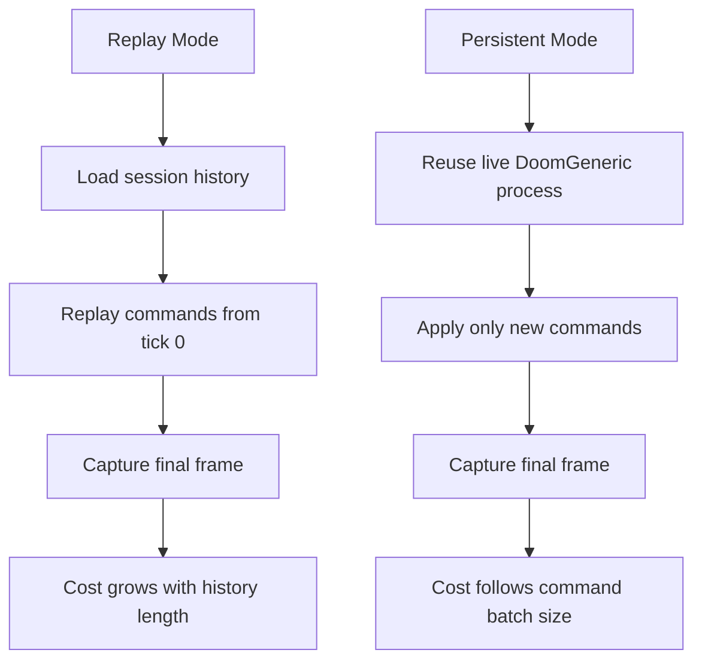
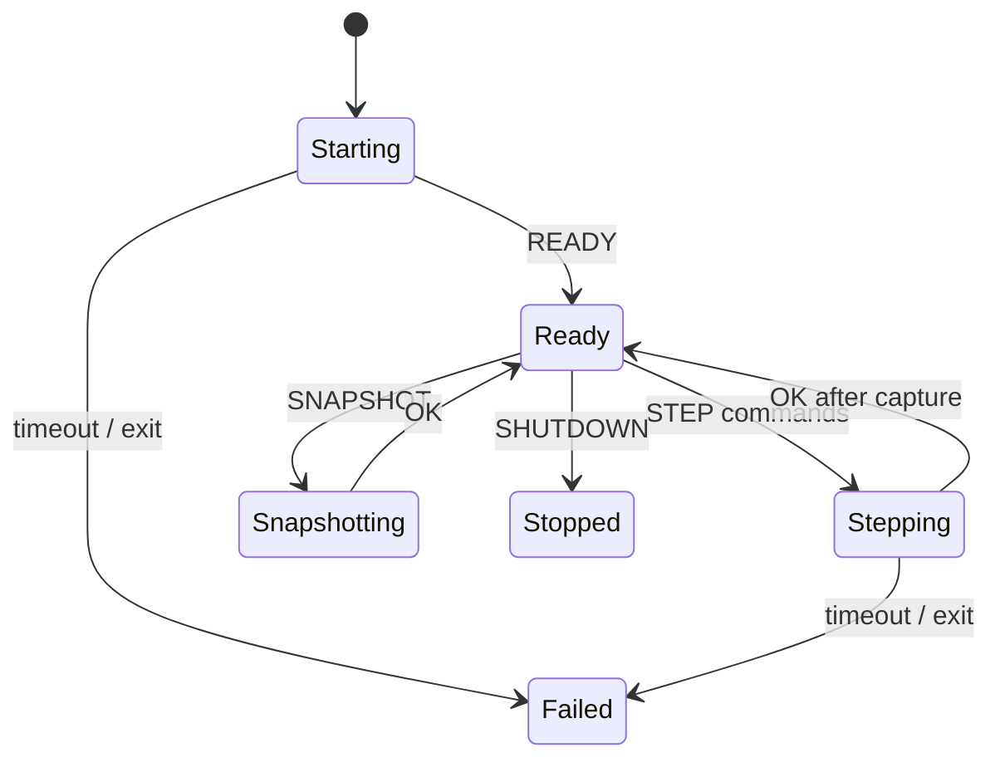
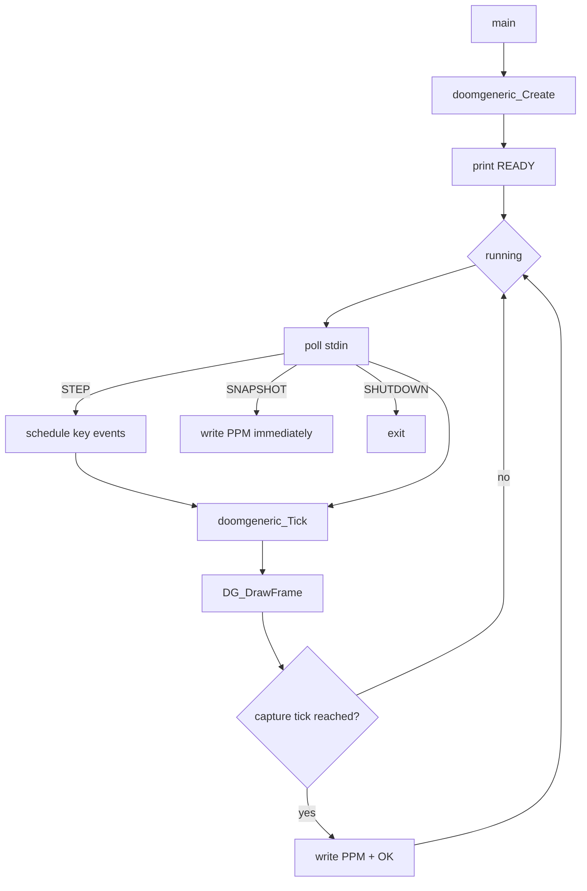
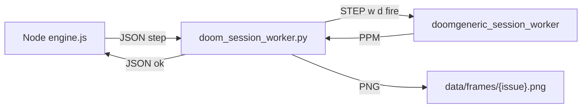
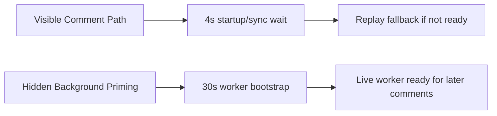

# Persistent DoomGeneric Design

## Why Persistence Matters

Replay rendering gets slower as history grows because each later frame replays more commands from the beginning of the session. A live DoomGeneric worker keeps the game state in memory, so a new comment applies only the new command batch.

## Native Worker Protocol

## C Worker Loop

V4 changed the native worker to match the DoomGeneric port model:

## Python Bridge

The Python worker owns three jobs:

- spawn the native DoomGeneric worker
- translate Node JSON messages into native text protocol messages
- convert the native PPM output into the PNG expected by the rest of the app

## Startup Output Handling

DoomGeneric can print normal startup text to stdout before protocol messages. V4 treats only these as protocol:

- `READY`
- `OK...`
- `ERR...`

Other stdout lines are logged to stderr as `doomgeneric_session_stdout=...` and ignored by the protocol parser.

## Timeout Split

This avoids bringing back minute-long user stalls while still allowing the hidden native worker enough time to boot.
