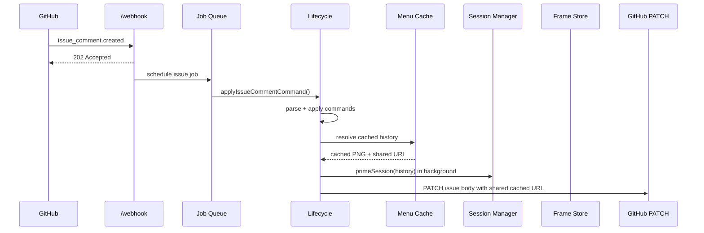
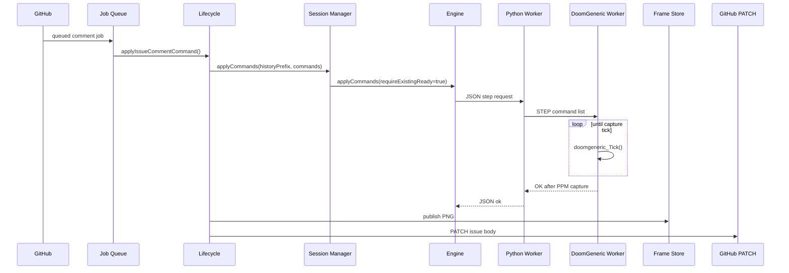
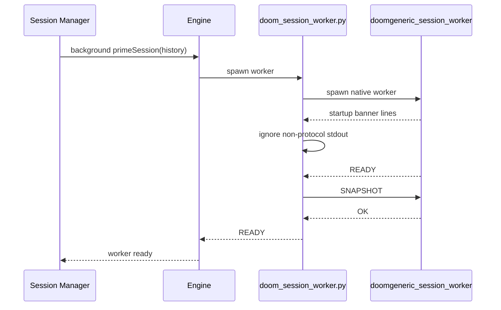
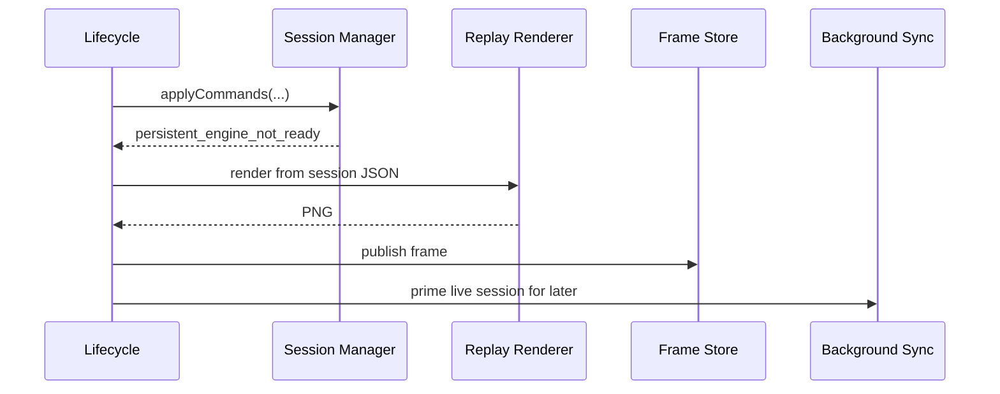
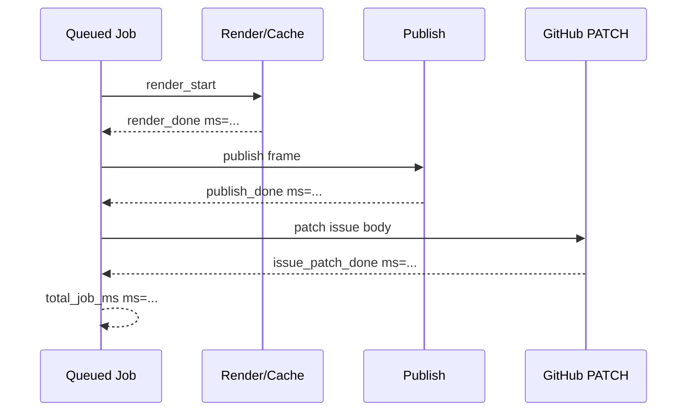

# V4 Runtime Sequences

## Comment With Cached Menu Frame

```mermaid
sequenceDiagram
  participant GH as GitHub
  participant WH as /webhook
  participant Q as Job Queue
  participant LC as Lifecycle
  participant MC as Menu Cache
  participant SM as Session Manager
  participant FS as Frame Store
  participant API as GitHub PATCH

  GH->>WH: issue_comment.created
  WH-->>GH: 202 Accepted
  WH->>Q: schedule issue job
  Q->>LC: applyIssueCommentCommand()
  LC->>LC: parse + apply commands
  LC->>MC: resolve cached history
  MC-->>LC: cached PNG + shared URL
  LC->>SM: primeSession(history) in background
  LC->>API: PATCH issue body with shared cached URL
```

## Comment With Live Persistent DoomGeneric

```mermaid
sequenceDiagram
  participant GH as GitHub
  participant Q as Job Queue
  participant LC as Lifecycle
  participant SM as Session Manager
  participant ENG as Engine
  participant PY as Python Worker
  participant C as DoomGeneric Worker
  participant FS as Frame Store
  participant API as GitHub PATCH

  GH->>Q: queued comment job
  Q->>LC: applyIssueCommentCommand()
  LC->>SM: applyCommands(historyPrefix, commands)
  SM->>ENG: applyCommands(requireExistingReady=true)
  ENG->>PY: JSON step request
  PY->>C: STEP command list
  loop until capture tick
    C->>C: doomgeneric_Tick()
  end
  C-->>PY: OK after PPM capture
  PY-->>ENG: JSON ok
  LC->>FS: publish PNG
  LC->>API: PATCH issue body
```

## Persistent Worker Startup

```mermaid
sequenceDiagram
  participant SM as Session Manager
  participant ENG as Engine
  participant PY as doom_session_worker.py
  participant C as doomgeneric_session_worker

  SM->>ENG: background primeSession(history)
  ENG->>PY: spawn worker
  PY->>C: spawn native worker
  C-->>PY: startup banner lines
  PY->>PY: ignore non-protocol stdout
  C-->>PY: READY
  PY->>C: SNAPSHOT
  C-->>PY: OK
  PY-->>ENG: READY
  ENG-->>SM: worker ready
```

## Replay Fallback

```mermaid
sequenceDiagram
  participant LC as Lifecycle
  participant SM as Session Manager
  participant RW as Replay Renderer
  participant FS as Frame Store
  participant BG as Background Sync

  LC->>SM: applyCommands(...)
  SM-->>LC: persistent_engine_not_ready
  LC->>RW: render from session JSON
  RW-->>LC: PNG
  LC->>FS: publish frame
  LC->>BG: prime live session for later
```

## Latency Log Shape

```mermaid
sequenceDiagram
  participant JOB as Queued Job
  participant R as Render/Cache
  participant P as Publish
  participant GH as GitHub PATCH

  JOB->>R: render_start
  R-->>JOB: render_done ms=...
  JOB->>P: publish frame
  P-->>JOB: publish_done ms=...
  JOB->>GH: patch issue body
  GH-->>JOB: issue_patch_done ms=...
  JOB-->>JOB: total_job_ms ms=...
```

